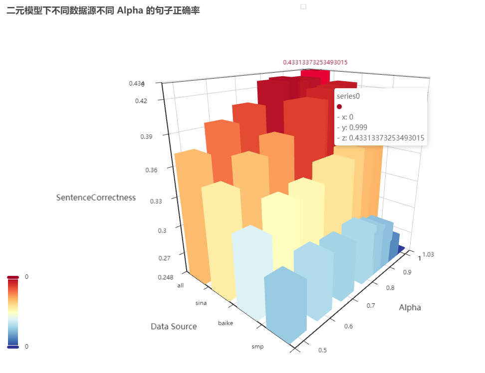
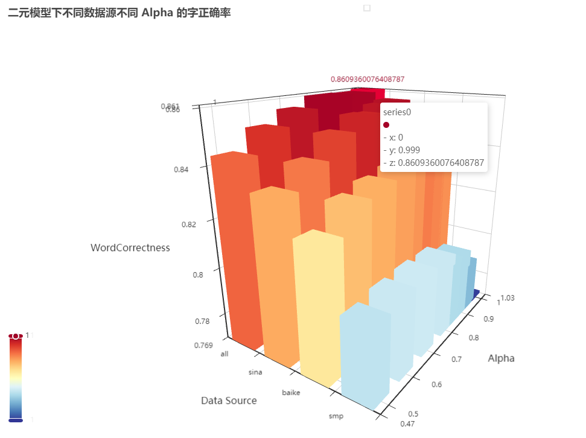
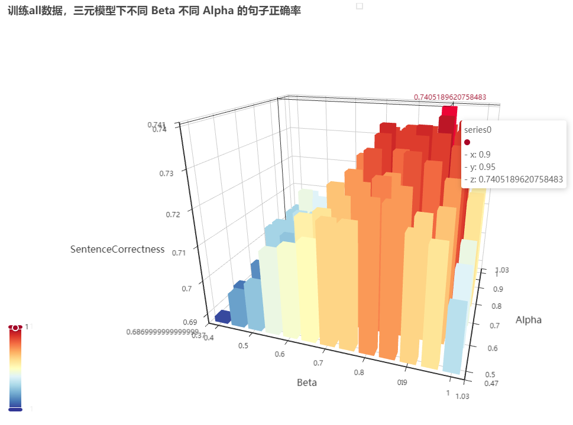
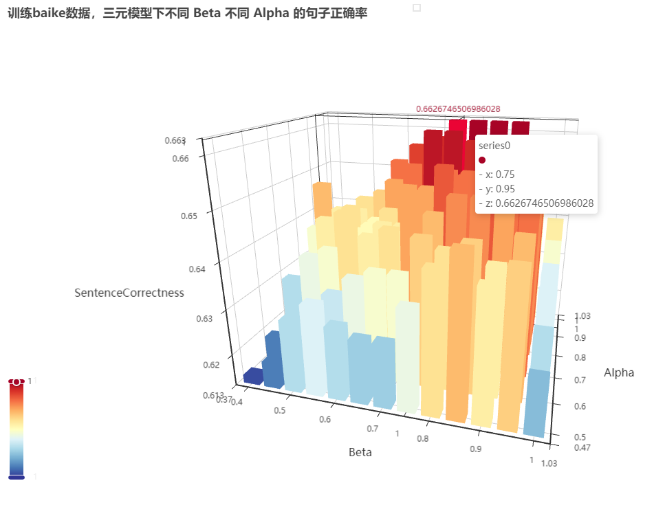
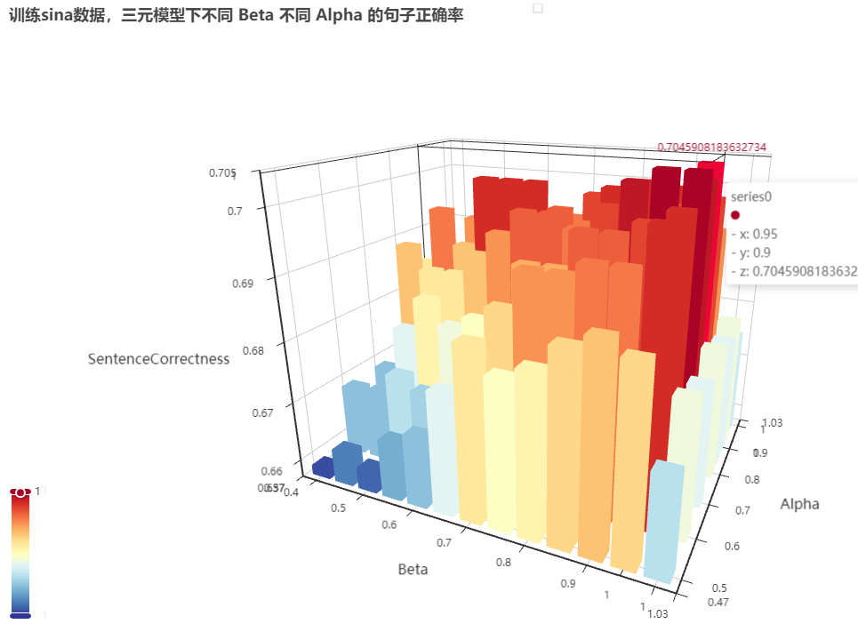
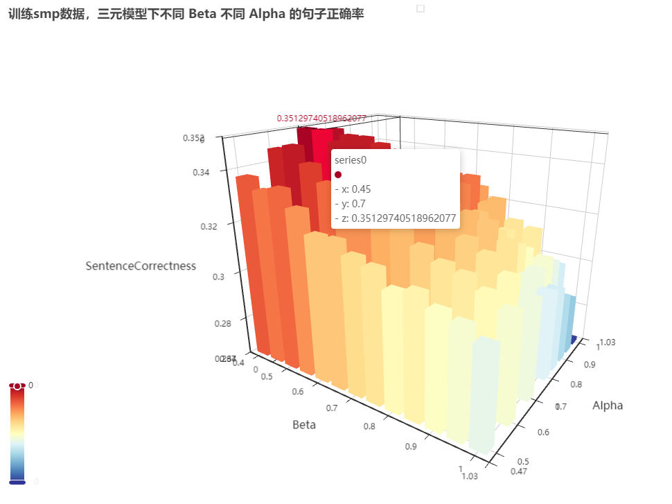
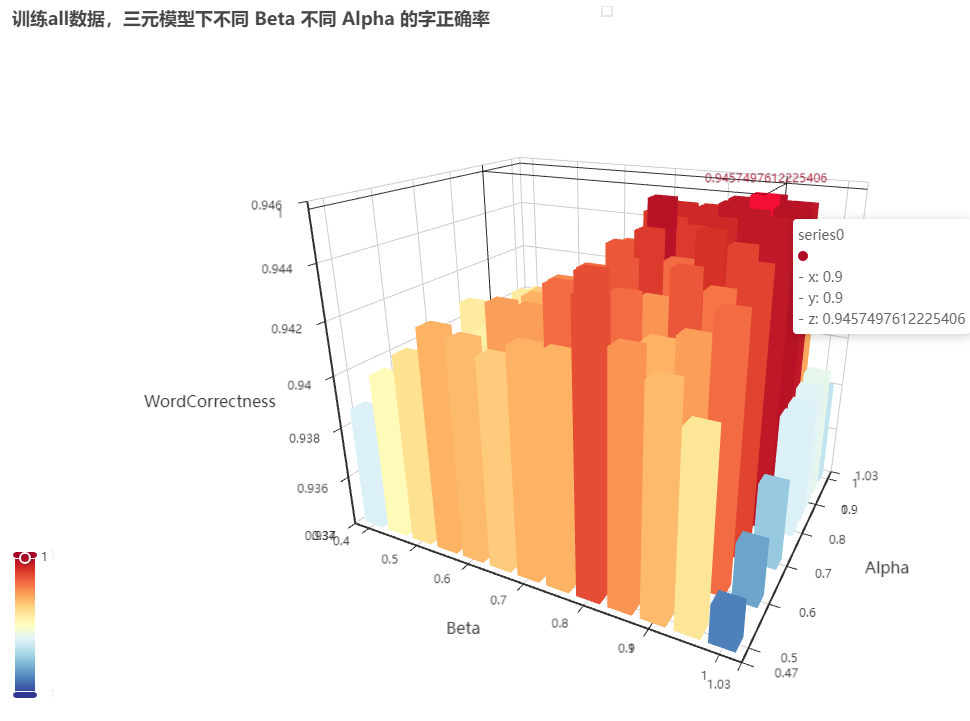
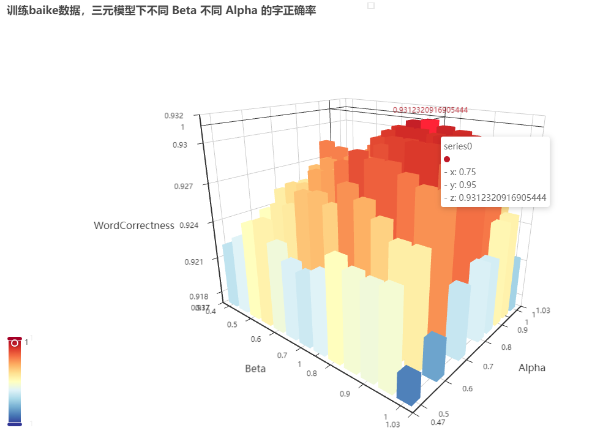
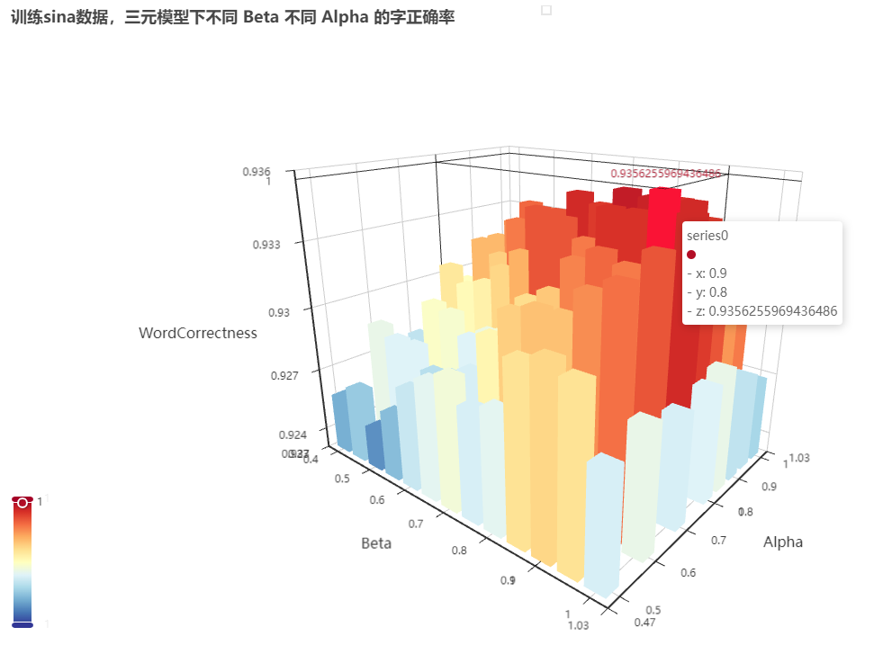
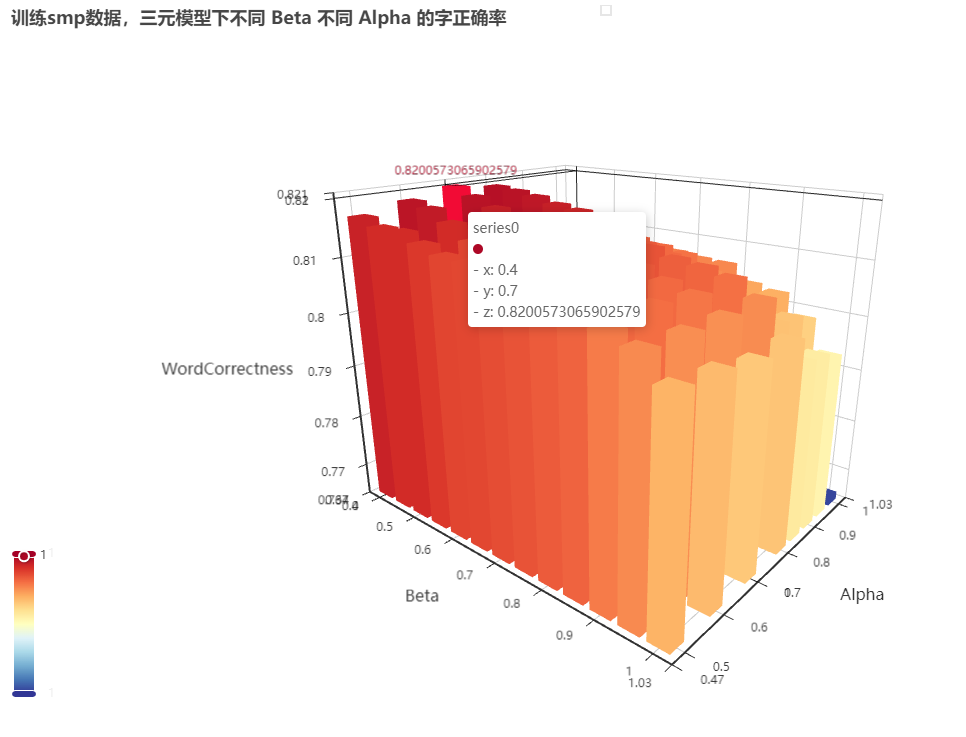

# 拼音输入法

<h4 style="text-align:center">计 14 刘铠铭 2020030014</h4>

## 一、代码框架与使用说明

本实验通过实现基于字的二元模型算法及三元模型算法，完成了通过拼音预测汉字的任务。

### 1. 代码框架

请从 [拼音输入法源文件-清华云盘](https://cloud.tsinghua.edu.cn/d/ebd92a17f1224d569746/) 下载文件，使用如下结构：

``` bash
-- pinyin
|
|-- data
|   |-- *.json # 共 18 个文件，其中包括一二级汉字表，拼音汉字对照表，
|              # 及各个数据集的统计文件
|-- datasets
|   |-- baike
|   |   |-- *.json # 百科问答数据集
|   |-- sina_news_gbk
|   |   |-- *.txt  # sina 数据集
|   |-- SMP2020
|   |   |-- *.txt  # SMP 数据集
|   |-- 一二级汉字表.txt
|   |-- 拼音汉字表.txt
|
|-- html
|   |-- *.html # 共 10 个文件，为实验结果的三维图像，
|              # 需使用浏览器打开
|-- images
|   |-- *.jpg  # 实验结果的部分截图，建议查看 html 图像
|
|-- out
|   |-- *.txt  # 标准测试输出结果
|   |-- *.json # 标准测试结果的 json 格式，供画图使用
|
|-- src
|   |-- __init__.py
|   |-- config.py # 配置信息，包含某些输入输出文件位置，某数据库总单词数等
|   |-- main.py   # 运行模型，执行输出或测试
|   |-- model.py  # 二元模型与三元模型的实现文件
|   |-- paint.py  # 根据标准测试结果生成三维柱状图
|   |-- preprocess.py # 预处理数据集
|   |-- process_raw_dataset.py # 对数据集原文件进行处理，供预处理使用
|   |-- test.py # 执行标准测试
|
|-- test
|   |-- input.txt       # 标准测试输入拼音
|   |-- std_output.txt  # 标准测试输出
|
|-- readme.md # 实验报告
|
|-- requirements.txt # 依赖 module
```

### 2. 使用方式

#### 2.1 环境配置

在根目录下执行： 

``` bash
conda create -n pinyin python=3.10
conda activate pinyin
pip install -r requirements.txt
```

#### 2.2 拼音生成

**请确保文件树中包括 `data` 目录下所有文件**

运行指令：`python src/main.py <args>`，可选参数包括：
- `--ziyuan [ZIYUAN]`: 使用几元模型，仅支持 2/3 两个选项，默认为三元；
- `-d/--data_from [SOURCE]`: 使用数据源，可选项为 [sina, smp, baike, all]，默认为 all，及使用所有数据集
- `-t/--test`: 是否为测试模式
- `-i/--input [INPUT]`: 输入文件，文件内格式因为每行一句，每个拼音间以空格隔开，为必选；
- `-o/--output [OUTPUT]`: 输出文件，将结果保存在文件中，为可选；
- `-a/--answer [ANSWER]`: 答案文件，输入文件的答案所在位置，测试模式下必选
- `--interaction`: 交互模式，可持续输入拼音并输出句子，优先级高于测试模式&文件输入输出
- `--alpha`: 模型中的 alpha 值，解释见后，默认为 0.99
- `--beta`: 模型中的 beta 值，解释见后，默认为 0.95

使用样例：
- 交互模式，使用 sina 数据集，二元模型：
  - ``` bash
    ❯ python src/main.py --interaction --ziyuan 2 -d sina
    请输入一个句子的拼音，每个拼音间以空格分隔，若要退出可输入"q"：
    qing hua da xue shi shi jie yi liu da xue
    清华大学是世界一流大学
    请输入一个句子的拼音，每个拼音间以空格分隔，若要退出可输入"q"：
    q
    ```
- 普通文件输入文件输出，使用 smp 数据集，三元模型：
  - ``` bash
    ❯ python src/main.py --ziyuan 3 -d baike -i test/input.txt -o test/demo.txt
    北京是首歌举办过夏奥会与冬奥会的城市
    激起学习适当下非常火热的技术
    人工智能技术发展迅猛
    ...
    ```
  - 可在 `test/demo.txt` 中看到结果
- 测试模式，使用 all 数据集，三元模型，alpha = 0.95，beta = 0.5，输入输出答案文件见命令行
  - ``` bash
    ❯ python src/main.py -t --ziyuan 3 -d all -i test/input.txt -o test/demo.txt -a test/std_output.txt --alpha 0.95 --beta 0.5
    100%|█████████████████████████████████████████████████████████████████████████████████| 501/501 [01:03<00:00,  7.91it/s]
    使用字元数为 3 的字元模型
    测试句子数：501, 包含 5235 字
    正确句子数：364, 正确 4932 字
    句子正确率：0.726547
    字正确率：0.942120
    ```
  - 可在 `test/demo.txt` 中看到测试结果及所有句子输出

#### 2.3 其他操作

- 预训练
  - `python src/preprocess.py <args>`
  - 请确保 `datasets` 文件夹的完整性
  - 参数可通过 `python src/preprocess.py --help` 查看，在此不再赘述
- 标准测试
  - `python src/test.py --data_from [source]`
  - 对某一语料库进行标准测试，结果保存在 `out` 文件夹下，可通过 `src/config.py` 更改配置
- 图像输出
  - `python src/paint.py`
  - 将标准测试中的结果绘制为三维柱状图

## 二、模型原理分析

### 1. 基于字的二元模型

#### 1.1 算法原理

给定拼音序列 $\{p_1,p_2,\cdots,p_n\}$，其中 $p_i$ 为第 $i$ 个汉字的拼音。令 $w_i$ 为第 $i$ 个汉字，即所求为序列 $w_1, w_2,\cdots,w_n$，使得 $P(w_1 w_2 \cdots w_n | p_1 p_2 \cdots p_n)$ 最大，所求序列即为：

$$
w_1 w_2 \cdots w_n= W = \mathop{arg max}\limits_{w_1, w_2, \cdots, w_n} P(w_1 w_2 \cdots w_n | p_1 p_2 \cdots p_n)
$$

由贝叶斯公式得：

$$
P(w_1 w_2 \cdots w_n | p_1 p_2 \cdots p_n) = \dfrac{P(p_1 p_2 \cdots p_n | w_1 w_2 \cdots w_n) \cdot P(w_1 w_2 \cdots w_n)}{P(p_1p_2 \cdots p_n)}
$$

又：

$$
\begin{cases}
P(p_1 p_2 \cdots p_n) = const \\
P(p_1 p_2 \cdots p_n | w_1 w_2 \cdots w_n) = 1
\end{cases}
$$

我们令 $P(W) = P(w_1 w_2 \cdots w_n)$，因此所求即为：

$$
\begin{aligned}
	W & = \mathop{\arg \max}\limits_{w_1, w_2, \cdots, w_n} P(W) \\
	& = \mathop{\arg \max}\limits_{w_1, w_2, \cdots, w_n} P(w_1 w_2 \cdots w_n) \\
	& = \mathop{\arg \max}\limits_{w_1, w_2, \cdots, w_n} P(w_1) P(w_2 |w_1) P(w_3 | w_1 w_2) \cdots P(w_n | w_1 w_2 \cdots w_{n - 1}) \\
	& \approx \mathop{\arg \max}\limits_{w_1, w_2, \cdots, w_n} P(w_1) P(w_2 | w_1) P(w_3 | w_2) \cdots P(w_n | w_{n - 1}) \\
	& = \mathop{\arg \max}\limits_{w_1, w_2, \cdots, w_n} \prod_{i = 1}^n P(w_i | w_{i - 1})
\end{aligned}
$$

其中 $P(w_i | w_1 w_2 \cdots w_{i - 1})$ 为已知前 $i-1$ 个汉字为 $w_1,w_2, \cdots ,w_{i - 1}$ 时，第 $i$ 个字为 $w_i$ 的概率；$P(w_i | w_{i - 1})$ 为已知前一个汉字为 $w_{i-1}$ 时，该汉字为 $w_i$ 的概率；$P(w_1|w_0)$ 为 $w_1$ 位于句首的概率。

用频率估计概率，有：

$$
\begin{aligned}
P(w_i | w_{i - 1}) & = P^*(w_i | w_{i - 1}) \\
& = 
\begin{cases}
	\dfrac{count(w_{i - 1} w_i)}{count(w_{i - 1})} & \mathrm{count}(w_{i - 1}) > 0 \\
	0 & \text{otherwises.}
\end{cases}
\end{aligned}
$$

其中 $count(w_{i - 1} w_i),count(w_{i - 1})$ 分别表示 $w_{i-1}w_i,w_{i-1}$ 在语料库中语料库中出现的频次；特殊的，$P(w_1|w_0)\approx \dfrac{count\_as\_first(w_1)}{count\_all}$，其中 $count\_as\_first(w_1)$ 表示 $w_1$ 作为首字符出现的频次，$count\_all$ 表示语料库中的总字数。

同时考虑到部分 $P(w_i | w_{i - 1})$ 很小，需要进行平滑处理：

$$
P(w_i | w_{i - 1}) \approx \alpha P^*(w_i | w_{i - 1}) + (1 - \alpha) P^*(w_i)
$$

在实际运算中，为了避免乘积运算，我们对 $\max\limits_{w_1, w_2, \cdots, w_n} \prod_{i = 1}^n P(w_i | w_{i - 1})$ 取负对数：

$$
f = -\min\limits_{w_1, w_2, \cdots, w_n} \sum_{i=1}^{n}\log P(w_i | w_{i - 1})
$$

用 ${f}_{i,w}$ 表示前 $i$ 个汉字，第 $i$ 个汉字为 $w$ 的最小负对数；$l_{i,w}$ 则表示前 $i$ 个汉字，第 $i$ 个汉字为 $w$ 时第 $i-1$ 个汉字。

初始值为：

$$
{f}_{i,w} = -\log \dfrac{count\_as\_first(w)}{count\_all}
$$

容易得到转移方程：

$$
\begin{cases}
f_{i + 1, w_{i+1}} = \min\limits_{w_i \in \mathrm{P2W}(p_i)} \left(f_{i, w_i} - \log P(w_{i+1} | w_i) \right) \\
\mathrm{l}_{i + 1, w_{i+1}} = \mathop{\arg \min}\limits_{w_i \in \mathrm{P2W}(p_i)} \left(f_{i, w_i} - \log P(w_{i+1} | w_i) \right)
\end{cases}
$$

其中 $\mathrm{P2W}(p_i)$ 表示拼音为 $p_i$ 时的所有汉字集合。

#### 1.2 实现说明

实现见 `src/model.py` 中 `class WordModel()`，初始化时令 `ziyuan=2`，`data_from=...` 确定二元模型并读入相应的预料信息。

`def forward()` 为模型的统一接口，`def __forward_binary` 实现了二元的最优预测。

### 2. 基于字的三元模型

#### 2.1 算法原理

类似二元模型，此时：

$$
\begin{aligned}
	W & = \mathop{\arg \max}\limits_{w_1, w_2, \cdots, w_n} P(W) \\
	& = \mathop{\arg \max}\limits_{w_1, w_2, \cdots, w_n} P(w_1 w_2 \cdots w_n) \\
	& = \mathop{\arg \max}\limits_{w_1, w_2, \cdots, w_n} P(w_1) P(w_2 |w_1) P(w_3 | w_1 w_2) \cdots P(w_n | w_1 w_2 \cdots w_{n - 1}) \\
	& \approx \mathop{\arg \max}\limits_{w_1, w_2, \cdots, w_n} P(w_1) P(w_2 | w_1) P(w_3 | w_1 w_2) \cdots P(w_n | w_{n - 2} w_{n - 1}) \\
	& = \mathop{\arg \max}\limits_{w_1, w_2, \cdots, w_n}\prod_{i = 1}^n P(w_i | w_{i - 2} w_{i - 1})
\end{aligned}
$$

其中 $P(w_1|w_{-1}w_0)$ 为 $w_1$ 位于句首的概率，$P(w_2|w_0w_1) = P(w_2|w_1)$

用频率估计概率，有：

$$
\begin{aligned}
P(w_i | w_{i - 2} w_{i - 1}) & = P^*(w_i | w_{i - 2} w_{i - 1}) \\
& = 
\begin{cases}
	\dfrac{\mathrm{count}(w_{i - 2} w_{i - 1} w_i)}{\mathrm{count}(w_{i - 2} w_{i - 1})} & \mathrm{count}(w_{i - 2} w_{i - 1}) > 0 \\
	0 & \text{otherwises.}
\end{cases}
\end{aligned}
$$

此时依然需要平滑处理：

$$
\begin{aligned}
	P(w_i | w_{i - 2} w_{i - 1}) & \approx \beta P^*(w_i | w_{i - 2} w_{i - 1}) + (1 - \beta) P(w_i | w_{i - 1}) \\
	& \approx \beta P^*(w_i | w_{i - 2} w_{i - 1}) + (1 - \beta) \left[\alpha P^*(w_i | w_{i - 1}) + (1 - \alpha) P^*(w_i) \right]
\end{aligned}
$$

转移方程与二元基本相同：

$$
\begin{cases}
f_{i + 1, w_{i+1}, w_{i+2}} = \min\limits_{w_i \in \mathrm{P2W}(p_i)} \left(f_{i, w_i, w_{i+1}} - \log P(w | w_iw_{i+1}) \right) \\
\mathrm{l}_{i + 1, w_{i+1}, w_{i+2}} = \mathop{\arg \min}\limits_{w_i \in \mathrm{P2W}(p_i)} \left(f_{i, w_i, w_{i+1}} - \log P(w | w_iw_{i+1}) \right)
\end{cases}
$$

符号说明：
- 用 ${f}_{i,w,w+1}$ 表示前 $i$ 个汉字，已知第 $i$ 个汉字为 $w$ ，第 $i+1$ 个汉字为 $w_{i+1}$ 的最小负对数；
- $\mathrm{P2W}(p_i)$ 表示拼音为 $p_i$ 时的所有汉字集合。
- $l_{i,w,w_{i+1}}$ 则表示前 $i+1$ 个汉字，第 $i, i+1$ 个汉字为 $w, w_{i+1}$ 时第 $i-1$ 个汉字。

每次计算第 $i+1$ 个状态时：
- 迭代 $f[i]$ 中所有的第 $i$ 个字
  - 迭代 $f[i][w_i]$ 中所有的第 $i+1$ 个字
    - 迭代所有的 $P2W(pinyin_{i+2})$，计算 $f[i+1][w_{i+1}][w_{i+2}]$
      - 进而判断是否更改 $f$ 及 $l$

不少同学在完成三元字模型后发现准确率甚至低于二元，这是因为他们使用的仍是一维的 Viterbi 算法，而实际上 DP 前进时每一个字都受到之前两个字的影响，应该使用二维，否则即使考虑了三个字同时出现的频次依然作用不大。

#### 2.2 实现说明

实现见 `src/model.py` 中 `class WordModel()`，初始化时令 `ziyuan=3`，`data_from=...` 确定三元模型并读入相应的预料信息。

`def forward()` 为模型的统一接口，`def __forward_ternary` 实现了三元的最优预测。

## 三、语料库与数据预处理

### 语料库的选择

本实验使用了新浪，SMP，百科问答三个语料库，同时通过将三个语料库的模型整合得到总的预训练数据，在本实验框架中称该数据源为 `all`。

### 数据预处理

对于每一种语料库，首先通过 `src/precess_raw_dataset.py` 中相应的函数，返回一个生成器，每次迭代时返回内容为：

```python
['这是一个？句子',
 ['zhe', 'shi', 'yi', 'ge', '*', 'ju', 'zi']]
```

本实验框架考虑多音字，使用 `pypinyin` 进行处理；

之后，`src/preprocess.py` 中会统计[某个字出现的次数, 某个字在可能的句首出现的次数, 某两个字连续出现的次数, 某三个字连续出现的次数]，值得展开说明的是：
- 每个字的保存方式为 `'字pinyin'`，例如 `'你ni'`；
- 对于新浪新闻，采用分别统计每个月份的次数，之后采用 `merge()` 函数进行合并；
- 在三个语料库均统计完成后，可以使用 `python src/preprocess.py --all` 进行合并，得到 `all` 语料库。

## 四、结果及分析

**本部分实验结果强烈建议您使用浏览器打开 html/ 文件夹下的文件进行观看，每一张结果可以三维旋转方向并缩放大小，同时可以拖动左方数值图来筛选柱状图。**

**在查看不同的柱状图时，请注意看清楚 z 轴范围。为了使不同 alpha/beta 超参数的对比更明显，我采用了 (min_correctness, max_correctness) 分别向下上取整作为 z 轴的边界。**

`images/` 文件夹下存在结果的相关截图。

### 1. 二元模型整体分析

测试结果：
- 句子准确率：
  - 
- 字准确率：
  - 

分析：
- 观察到，对于 [all, sina, baike] 三个预料库，无论是句子正确率还是字正确率，$\alpha=0.999$ 时均取值最高。然而 smp 语料库此时取值最低。这可能是因为训练数据大小的原因。因为 smp 语料库的训练量很小（小于其他语料库至少两个数量级），导致当不做平滑处理时，预测结果很差。
- 而对于其他三个语料库，由于总字数均达到亿的量级，此时模型二元预测准确率会随着 $\alpha$ 的增大而提高。
- 通过不同语料库结果对比，由于 all 综合了三个语料库因此自然准确率最高。但是，虽然 baike 的数据量和 sina 接近，然而 sina 语料库的准确率却明显高于 baike 语料库且接近 all 语料库，这可能是因为 sina 语料库内的数据更加综合全面，且出现的“二元字”有可能更偏向于词且集中性或许相比 baike 更高。

### 2. 三元模型整体分析

测试结果：
- 句子准确率：
  - 
  - 
  - 
  - 
- 字准确率：
  - 
  - 
  - 
  - 

分析：
- 和二元类似，当 $\beta$ 值比较高，即平滑处理较少时，smp 语料库的准确率会随之下降，这是由于训练数据较少的缘故。由于 smp 语料库不具有代表性，之后的分析将暂时忽略 smp 语料库。
- 对于某一语料库，其句子准确率和字准确率取最大值时的取值不尽相同，例如对于 sina 数据库，其句子准确率最高时 $\alpha=0.95, \beta=0.9$，字准确率最高时 $\alpha=0.9, \beta=0.8$。这可能是因为语言的特殊性与复杂性，以及语料库和测试数据的相关性和语料库的语句综合性导致的。
- 对于不同的语料库，其句子准确率和字准确率取最大值时 $\alpha, \beta$ 的取值也不完全相同。但基本均在 $\beta=\alpha=0.9$ 左右取到（除 smp 语料库）。 
- 宽梯度来看，$\alpha, \beta$ 的取值对准确率影响不大，例如对于 all 语料库，字准确率最低为 $93.54\%$，最高为 $94.57\%$，这说明三元模型已经比较完善，即使 $\beta$ 在 $[0.4,0.999]$ 的范围内波动影响也不大。
- 细梯度来看，$\alpha, \beta$ 的取值波动又很大，观察 sina 数据的句子准确率图像可以看出，结果“高低起伏，上下震荡”，这说明字模型不稳定，其本身的预测由于没有基于字可能并不精确稳定，针对不同的训练数据也可能表现出不同的效果。
- $\beta = 0.999$ 时模型的预测水平均较低，这可能是由于在统计三元字时，不少三元字并非一个词且存在的频次很少，例如
- sina 和 baike 两个数据库的对比与二元字模型相同，sina 语料库更加的综合全面，或者说其可能更适合字模型。

### 3. 两种模型的对比

三元模型的准确率相比二元模型得到了明显提高，这点并不奇怪。但是观察两种模型的结果，我们可以发现有趣的结果，不少在二元字模型下分析正确的句子，在三元字模型下却得到了错误的结果，例如：

```
二元：北京是首个举办过夏奥会与冬奥会的城市
三元：北京市首个举办过夏奥会与冬奥会的城市
```

表面来看，该问题为语料库的原因，在预料库中 “北京市” 出现的概率更高，但深层次看我认为这却是字模型本身算法的弊端：
- 无法以词为单位，例如从“京市”可以推出来下一个字最有可能是“首”，然而实际上这些并无必要关系。也就是说，基于字的模型无法体现汉语以“词”为基本单位的特点。
- 无法看到下文，无论是基于字的模型还是基于词的模型，其在推测过程中都是单向的，即只能从句首到句尾。若其能看到下一个词为形容词“首个”，便应该可以推测出前面的词为“北京是”而非“北京市”。这或许也就是普通的 DP 与循环神经网络之间的差距。

### 4. 三元模型的案例分析

其实从 3 的分析可以看出，基于字的模型弊端在于：
- 对语料库依赖性大，语料库对不同的词语有不同的依赖性；
- 对上下文理解不到位；
- 无法理解汉语中的基本单位“词”。

这些可以很容易的从以下给出的错误案例中看出，在此不再赘述（使用 all 语料库，$\alpha = 0.95, \beta = 0.9$）：
- 北京*市*首个举办过夏奥会与冬奥会的城市
- 永远局部最优解的人到不了全局最*有*
- *指导*博士毕业迷茫的时候
- 对不起我*市*警察
- *水*都不会受伤的世界完成了

然而，也有很多令人感到意外与惊喜的正确案例（使用 all 语料库，$\alpha = 0.95, \beta = 0.9$）：
- 中国共产党员的初心和使命是为中国人民谋幸福为中华民族谋复兴
- 大地上的一切都被勤劳的双手修饰的那么和谐
- 寻寻觅觅冷冷清清凄凄惨惨戚戚
- 吃嘛嘛香
- 不积跬步无以至千里

可以看出，字模型在古文以及长难句也能有不错的表现。

### 5. 多音字对模型准确率的影响分析

通过和同学结果的对比，我发现尽管我的代码实现了多音字模型（利用 `pypinyin` 包对多音字进行分析），然而其最终效果却和同学基本相同。我认为这是因为测试数据较少且测试数据对多音字依赖性不高，而不是因为多音字本身处理没有用处。

从本质上讲，我们的推测模型由音推测到字，因此不同音的相同汉字应当被认为是不同的字来统计频次并进行不同的处理，应当进行特殊处理。

### 6. 对四元字模型，词预测模型的预测与猜想

我认为四元字模型相比三元字模型的提高程度不会很高，相反，由于字模型的连续汉字之间并无特殊意义，其最终结果可能表现得和三元字模型基本相同。并且，四元字模型对平滑的要求可能更高，因为其统计到的无效连续四字可能更多。

而词模型由于能够注意到汉字以词为基本单位的特征，当其“词元”增加时，其准确率会随之不断提高。并且相比于字模型，词模型对平滑的需求也会缩小，在不进行平滑处理的小规模语料库中或许也会有不错的表现。

## 五、实验感想

这是我写的第一个从原理出发一步步从零实现的 AI 模型，让我认识到了 AI 不只有深度学习，即使是最简单的搜索也能达到非常好的效果。我在大一时曾“跟风”研究过一段时间 AI，但是后来在没有深入了解原理的情况下便觉得 AI 就是套模型调参数，并且认为整个研究氛围很浮躁。然而这次从数据预处理开始，到模型的实现，再到模型测试，数据整理，每一步都会让我感到很强的收获感与满足感，写完实验报告时又会有一种酣畅淋漓的快感。我体会到了 AI 不只是浮躁的调模型发论文，而是一个可以帮助我们解决生活问题的工具手段。总之非常感谢这次实验，改变了我当初固有的刻板印象。
