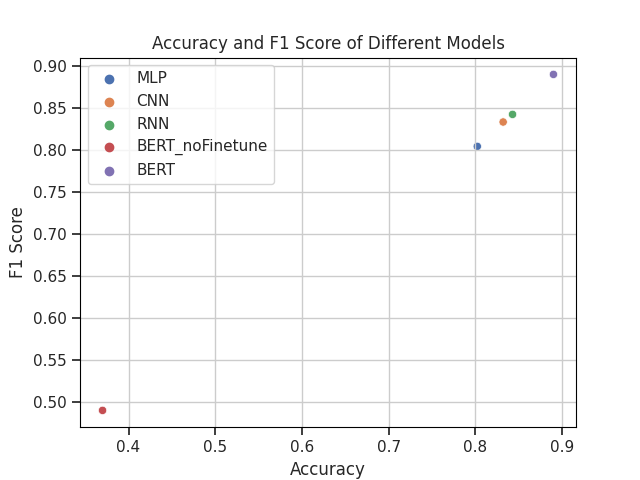
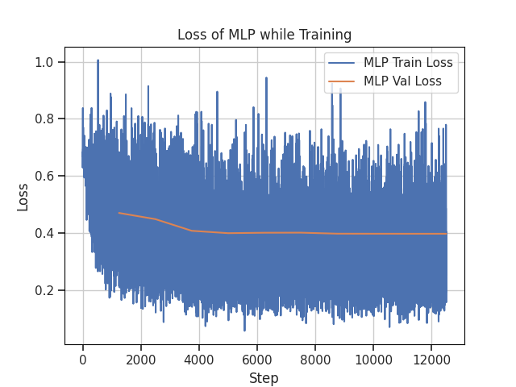

# 人工智能导论

<h4 style="text-align: center"> 刘铠铭 2020030014 计14 </h4>

## 1. 模型分析

### 1.0 模型抽象

假设每条语句有 $n$ 个单词，第 $i$ 个单词记为 $w_i$，我们利用 $\mathrm{Word-Embedding}$ 将 $w_i$ 表示为 $k$ 维向量 $x_i \in \R^k$，则每个句子表示为：

$$
X_{1:n} = (x_1, x_2, x_n)^T \in \R^{n \times k}
$$

在实验中，将每个句子统一通过 $\mathrm{padding}$ 的方法填充到相同的长度。由于任务为二分类任务，因此模型的输出统一为 $(p_0,p_1)$。

注：

1. 本实验中 MLP、CNN、RNN 模型均利用题目中给出的 `wiki_word2vec_50.bin` 进行编码，且不随训练发生改变；Bert 采用 `AutoTokenizer.from_pretrained("bert-base-chinese")` 进行编码；
2. 为提高效率，本实验模型在输出时未采用 $\mathrm{softmax}$ 函数进行处理，在进行数据处理时使用 `.argmax()` 进行处理；
3. 本实验采用 MLP 模型作为 Baseline，共实现了 MLP、CNN、RNN、Bert 等模型。

### 1.1 MLP

> 具体实现见 `src/model.py class MLP()`

模型的结构图大致如下为：


本实现模型按顺序包括：
- 嵌入层：维数为 $(len(word2id) + 1, 50)$，$len(word2id)$ 为 `wiki_word2vec_50.bin` 内所有单词的数量，之所以 $+1$ 是因为 $\mathrm{padding}$ 时给句子结尾补 $0$，并使其编码结果为零向量；
- 全连接层1：维数为 $(50, 128)$；
- Relu 层：使用激活函数，使模型非线性；
- 一维最大池化层：对输出代表句子长度的维度使用最大池化（本实现中为 `permute` 后的第 $2$ 维，长度为设置的句子长度）；
- 全连接层2：维数为 $(128, 2)$，输出结果。 

### 1.2 CNN

> 具体实现见 `src/model.py class CNN()`

模型的结构图大致如下：


本实现模型按顺序包括：
- 嵌入层：实现与 MLP 模型相同；
- 卷积层：共包含三组卷积核，独立对嵌入后的结果进行处理：
  - 卷积层1： 卷积核大小为 $3$，输入通道数为 $50$，输出通道数为 $128$；
  - 卷积层1： 卷积核大小为 $5$，输入通道数为 $50$，输出通道数为 $128$；
  - 卷积层1： 卷积核大小为 $7$，输入通道数为 $50$，输出通道数为 $128$；
- 最大池化层：对三组卷积核得到的结果分别通过一维最大池化层，对输出代表句子长度的维度使用最大池化；
- 全连接层：维数为 $(3 * 128, 2)$，将三组结果拼接后通过全连接层，输出结果。

### 1.3 RNN

> 具体实现见 `src/model.py class RNN()`

模型的结构图大致如下：


其中“RNN核”采用如下结构（GRU）：


本实现模型按顺序包括：
- 嵌入层：实现与 MLP 模型相同；
- 双向双层 GRU 层：输入大小为 $50$，隐藏层大小为 $128$，使用第二层 GRU 的两个方向上传播的隐藏层拼接后作为输出层的输入；
- 输出层，依次包括如下层：
  - 全连接层：维数为 $(256, 2)$；
  - Relu 层；
  - 全连接层：维数为 $(3 * 128, 2)$。

### 1.4 Bert

> 具体实现见 `src/llm_finetune.py`
> `src/llm.py` 中实现了无 finetune 版本

`tokenizer` 和 `model` 定义如下：

``` python
tokenizer = AutoTokenizer.from_pretrained("bert-base-chinese")
model = AutoModelForSequenceClassification.from_pretrained("bert-base-chinese")
```

Bert 的预训练&微调结构图如下：


其模型本质上实际是 Transformer 结构：


代码实现逻辑包括：
- 构造 `BertDataset`，构造 `trainer`；
- 使用 `trainer.train()` 进行 finetune；
- 使用 `trainer.predict()` 进行 test。

## 2. 实验结果及分析

### 2.1 模型间结果对比分析

LearningRate=0.001 && BatchSize=16 && maxLength=64 && epoch=10：



LearningRate=0.01 && BatchSize=16 && maxLength=64 && epoch=10：


分析：
- 表现情况为 $Bert >> RNN \approx MLP > CNN >> Bert\_no\_Finetune$；
- Bert Finetune 与未 Finetune 版本分别位于两级，因此对大模型进行 Finetune 很重要，且由于大模型在训练时参数更多，数据量更大，表现也会更好；
- 尽管按预测 RNN 在处理序列数据上应当表现得更好，但其优势与 CNN 和 MLP 相比并不明显，甚至在一些参数下 RNN 的效果不如 CNN 和 MLP，推测是由于如下原因：
  - 数据集不够典型，或数据集量不够大，导致 RNN 表现优势不够明显；
  - 三种模型对超参数的要求有一定区别，在相同参数下比较时其表现波动可能比较大。

### 2.2 初始 Learning Rate 影响分析

BatchSize=16 && epoch=10 && maxLength=64：


分析：
- 初始 Learning Rate = 0.001 时 CNN & RNN 表现最好，初始 Learning Rate = 0.01 时 MLP 表现最好；
- Learning Rate 过小时结果较差可能是因为训练速度较慢，在相同的 epoch 下其训练结果会变差；
- Learning Rate 过大时结果较差可能使得神经网络每次优化跨度过大，难以找到极小值。

### 2.3 Batch Size 影响分析

LearningRate=0.001 && epoch=10 && maxLength=64：


分析：
- CNN & MLP 受 Batch Size 影响较小，这可能是由于其网络结构中没有显式的时间顺序，每个输入样本之间是独立的，因此 Batch Size 对其影响不大；
- RNN 受 Batch Size 影响很大，尤其是当 Batch Size 较小时其训练效果很差。这可能是由于 RNN 的每个时间步的输出都依赖于前面时间步的输出，因此受影响较大；而较小的 Batch Size 会使得模型更新的稳定性降低，使得其训练难以收敛，也可能会出现过拟合的问题，因此准确率很低。

### 2.4 句子最大长度 Sentence Max Length 影响分析

LearningRate=0.001 && BatchSize=16 && epoch=10：


分析：
- 可以看到随着 Sentence Max Length 的增大，各模型的准确率均基本呈升高的趋势。这可能是由于 Sentence Max Length 越大，句子被截短的部分也就越少，模型能够得到的信息也就越多，因此准确率越高。同时也可能是模型参数量增加的结果。

<!-- ### 2.5 Epoch 影响分析

> 在测试 Epoch 影响时，依然使用了基于验证集的早期停止策略（实际上是基于验证集的早期停止策略和基于训练轮数的停止策略的结合），而非单纯基于训练轮数的停止。

LearningRate=0.001 && BatchSize=16 && maxLength=64：


分析：
- 测试结果符合基于验证集的早期停止策略和基于训练轮数的停止策略的结合的结果：
  - RNN 随 Epoch 的增加没有变化，可以看出，同时由于使用了基于验证集的早期停止策略，以及模型深度较浅，使用了一维卷积核等原因，其没有出现过拟合等风险。
  -  -->

## 3. 训练情况分析

LearningRate=0.001 && BatchSize=16 && maxLength=64 && epoch=10：




分析：
- MLP 和 RNN 收敛速度很快，且 RNN 在训练初的 Validation loss 出现上升，这可能是由于 RNN 对数据比较敏感，初期时其训练还不充分；
- CNN 训练效果明显，但收敛较慢。这可能是因为 CNN 处理带有时间性质的任务时并不擅长，因此需要大量数据的训练。而由于情感二分类问题比较简单，因此从训练结果上看 CNN 也会有较好的结果；
- 从 Validation loss 可以推测，在该任务中，CNN & RNN & MLP 的过拟合现象并不明显，这可能是数据量较少&模型设计比较简单以及利用 GRU 优化等原因；
- 从 Bert 的 Train loss 可以进一步看出，大模型的 Finetune 很有必要。

## 4. 问题思考

### 4.1 控制训练时间

实验训练的停止时机的确定往往有如下三种方法：
- 基于训练轮数的停止：该策略可能导致欠拟合或过拟合；
- 基于验证集的早期停止：在训练过程中，定期计算验证集上的性能指标，如准确率、损失函数等，一旦验证集上的性能指标不再改善，就停止训练。该策略可以避免模型的过拟合，而且可以避免计算资源的浪费，但若模型本身设计存在问题且停止策略过于绝对，则也面临欠拟合的风险；
- 基于计算资源的停止：设置预算来控制训练时间或计算资源，该方法在训练大模型时可能可以有效避免消耗计算资源。

实验训练停止的最佳时机：
- train loss 趋于稳定或有缓慢减小趋势；
- validation loss 不下降。

本实验采用 Early Stopping 与 固定 Epoch 数结合的方法来实现训练的停止：
- 确定一个固定的 epoch 进行训练，每完成一个 epoch 便进行验证；
- 若本次训练后结果在验证集上表现更好，则将该轮训练后的模型保存下来；
- 验证时取验证集表现最好的模型进行验证。

单纯固定迭代次数：
- 优点：代码实现简单；
- 缺点：需要根据不同的模型实现来具体设定精确的 epoch 取值，工作量大，否则便可能出现欠拟合或过拟合。

通过验证集调整：
- 优点：能有效避免过拟合现象，并且一定程度上可以控制训练的最大时长；
- 缺点：无法保证在验证集没有过拟合的情况下测试集也没有过拟合，存在欠拟合的风险。

### 4.2 参数初始化

本实验中各层参数的初始化均使用 `torch.nn` 的默认方法，具体而言均为 `kaiming` 初始化。

不同初始化方法分析：
- 零均值初始化：将每个参数初始化为 $0$ 均值。由于所有的参数都是相同的，网络的对称性很强，使得神经元的输出也非常类似，因此该方法的效果通常较差；
- 高斯分布初始化：使用均值为0和标准差为 $\sigma$ 的高斯分布随机初始化每个参数。该方法通常会在一定程度上打破对称性，但是也可能导致某些神经元的输出过大或过小，造成梯度消失或梯度爆炸的问题。因此，该方法通常用于较浅的网络；
- 正交初始化：该方法将每个参数初始化为一个正交矩阵，其可以有效地防止梯度爆炸或梯度消失问题，并且可以减少过拟合问题。但是由于正交矩阵很难生成，因此其可能会降低模型的准确性；
- Xavier 初始化：该方法根据输入和输出的维度来初始化每个参数，其标准差通过输入和输出维度的乘积来计算。该方法常用于深度网络，其可以使每一层的方差保持不变，从而避免了梯度消失和梯度爆炸等问题。
- Kaiming 初始化：该方法采用截断的正态分布，其标准差通过输入维度除以 $2$ 得到。该方法通常用于激活函数是 $\mathrm{ReLu}$ 时。

### 4.3 避免过拟合

有如下可行的方法：
- 数据增强：通过对训练数据进行变换或扩充，例如随机旋转、剪裁等方法来增加数据量，从而增加数据集的多样性；
- 正则化：通过在目标函数中增加一个惩罚项，从而防止权重过大导致过拟合；
- 早停法：通过监测模型在验证集上的性能表现来确定何时停止训练，从而避免过拟合；
- Dropout：通过随机地丢弃一些神经元，从而防止某些神经元过于强烈的适应训练数据，使模型学习更加鲁棒，减少过拟合的问题；
- 批归一化：在每一层的输出上应用归一化的操作，使得网络在训练过程中更加稳定。该方法不知可以减少过拟合问题，还可以提高网络的收敛速度和泛化性能；
- 集成学习：通过组合多个模型来提高准确性，减少过拟合问题，常见的方法有 $\mathrm{Bagging}, \mathrm{Boosting}, \mathrm{Stacking}$ 等。

### 4.4 分析 CNN & RNN & MLP 优缺点

CNN：
- 优点：
  - 适合处理图像、视频等具有空间结构的数据；
  - 卷积操作可以共享权重，进而减少模型参数量，增强模型泛化能力；
  - 池化操作可以降低空间维度，减少计算量，降低过拟合的风险；
  - 局部连接性，可以更好提取局部特征。
- 缺点：
  - 模型的可解释性较差；
  - 需要处理多维数据，同时有“通道”维，模型的构建与训练比较复杂；
  - 池化操作容易丢失信息，忽略局部与整体的相关性，需要通过增加卷积核来弥补。

RNN：
- 优点：
  - 适用于序列数据的处理，例如文本、音频等具有时间序列结构的数据；
  - 可以有效利用序列位置信息，可以处理任意长度的输入和输出序列；
  - LSTM 和 GRU 等改进模型能够有效解决传统 RNN 的梯度消失和爆炸等问题。
- 缺点：
  - 计算量较大，计算过程不能并行，训练效率较低；
  - 难以关注到序列中距离较远的相关信息；
  - 处理长序列时依然存在梯度消失和梯度爆炸等问题。

MLP：
- 优点：
  - 模型简单，容易理解；
  - 训练速度较快，拟合能力极强，收敛速度较快；
  - 方便进行并行处理与硬件加速；
  - 可以处理图像、文本、音频等多种类型的数据。
- 缺点：
  - MLP 模型没有考虑时间和空间结构；
  - 参数量较大，容易过拟合；
  - 隐藏层的规模规律不明显，模型精确设计比较困难。

## 5. 心得体会

通过这次实验，我体验了从零开始搭建深度学习模型的过程（当然也借用了 PyTorch 这一优秀的框架），对于三种常用的深度学习网络结构有了更深刻的了解，同时通过实验对他们的优缺点，使用场景也有了自己的总结。

并且自己还自学了 Transformer 等模型架构，并学习了如何利用 Bert 来进行 Finetune 与 Test。并通过和基础模型的对比，尽管只是一个很简单的任务，也能感受到大模型的强大。

感谢马老师和助教的悉心指导！